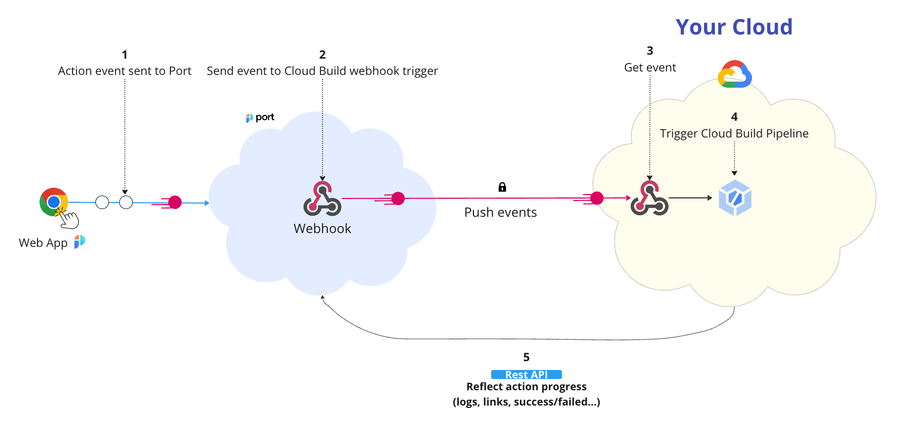
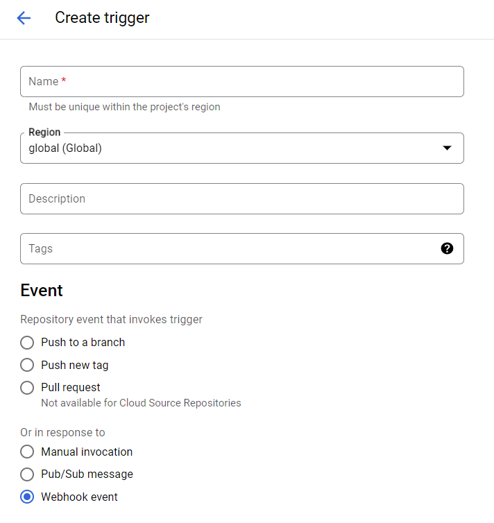
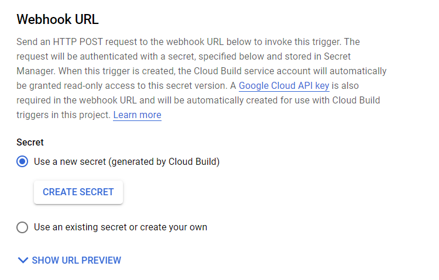
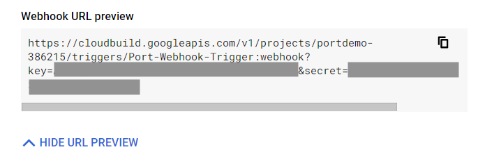
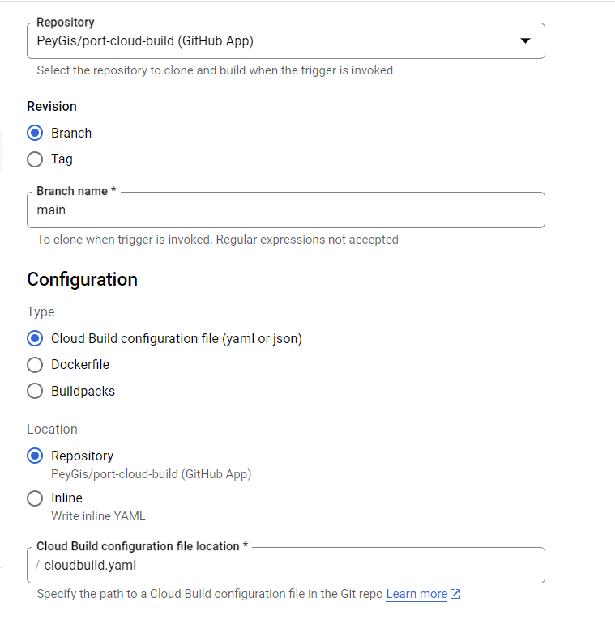

import Image from "@theme/IdealImage";
import DefineVars from "../../../../static/img/self-service-actions/setup-backend/jenkins-pipeline/define-variables.png";

# Triggering Cloud Build using webhooks

In this guide, you will learn how to trigger your [Cloud Build](https://cloud.google.com/build) Pipelines from Port, using [Webhook Actions](../webhook/).



The steps shown in the image above are as follows:

1. An action is invoked in Port;
2. Port signs the action payload using SHA-1 with the [`clientSecret`](../../../build-your-software-catalog/sync-data-to-catalog/api/api.md#find-your-port-credentials) value and puts it in the `X-Port-Signature` request header.

   :::info WEBHOOK SECURITY
   Verifying the webhook request using the request headers provides the following benefits:

   - Ensures that the request payload has not been tampered with
   - Ensures that the sender of the message is Port
   - Ensures that the received message is not a replay of an older message

   :::

3. Port publishes an invoked `WEBHOOK` via a `POST` request to `https://cloudbuild.googleapis.com/v1/projects/{project_id}/triggers/{webhook_name}:webhook?key={google_api_key}&secret={webhook_secret}`

An example flow would be:

1. A developer asks to run a Cloud Build pipeline;
2. Port sends a `POST` request with the action payload to the Cloud Build webhook `URL`;
3. The Cloud Build webhook receives the new action request;
4. The Cloud Build webhook triggers the pipeline;

## Prerequisites

Google Cloud Build required dependencies:

- Source Code Repository - You will be asked to authorize the Google Cloud Build service to access your GitHub, Gitlab or BitBucket account to proceed.
- GCP Services - You will need to enable the following GCP APIs if you are following this tutorial:
  1. Cloud Run;
  2. Cloud Build;
  3. Secret Manager;
  4. Artifact Registry.

## Setting up the webhook

### Configuring the pipeline

To enable triggering a Cloud Build pipeline using a webhook invocation, you will need to add a `cloudbuild.yaml` file or a `Dockerfile` to your source code repository's root directory. This enables Cloud Build to read the pipeline steps and execute the instructions.

The following example illustrates a simple Cloud Build pipeline that builds a container image, pushes the image to container registry and deploys it using Google Cloud Run. Copy and paste this code block into your `cloudbuild.yaml` file.

```yaml showLineNumbers
steps:
  # Build the container image
  - name: "gcr.io/cloud-builders/docker"
    args:
      [
        "build",
        "-t",
        "${_REGION}-docker.pkg.dev/$PROJECT_ID/${_REPOSITORY}/${_IMAGE_NAME}:${SHORT_SHA}",
        ".",
      ]
    id: Building the container image

  # Push the container image to Container Registry
  - name: "gcr.io/cloud-builders/docker"
    args:
      [
        "push",
        "${_REGION}-docker.pkg.dev/$PROJECT_ID/${_REPOSITORY}/${_IMAGE_NAME}:${SHORT_SHA}",
      ]
    id: Pushing the image to registry

  # Deploy container image to Cloud Run
  - name: "gcr.io/cloud-builders/gcloud"
    args:
      [
        "run",
        "deploy",
        "${_REPOSITORY}",
        "--image",
        "${_REGION}-docker.pkg.dev/$PROJECT_ID/${_REPOSITORY}/${_IMAGE_NAME}:${SHORT_SHA}",
        "--region",
        "${_REGION}",
        "--platform",
        "managed",
        "--allow-unauthenticated",
      ]

substitutions:
  # Repository Specific configuration. DevOps can change these as needed
  _REPOSITORY: <YOUR_CONTAINER_REPOSITORY_NAME>
  _IMAGE_NAME: $(body.payload.properties.imageName)
  _REGION: $(body.payload.properties.region)

options:
  substitution_option: ALLOW_LOOSE
  logging: CLOUD_LOGGING_ONLY
```

### Enabling the webhook trigger for a pipeline

On your Google Cloud Build page, go to the **Triggers** tab on the left sidebar, click on **Create Trigger** and fill in the form with the webhook information. Under **Event** choose "Webhook event"



By default, when enabling the webhook trigger for a pipeline, Google requires that you authenticate your webhook URL with a secret. This secret is automatically generated by Cloud Build, and it functions to secure incoming webhook requests.

After you have created or selected an existing secret, you will see a Webhook URL preview. This URL contains an API key generated by Cloud Build and your secret.





:::tip IAM Permissions
Make sure that the service account or API key running the webhook has permission to run CloudBuild pipelines. Follow Google's guideline on how to obtain an API key [here](https://cloud.google.com/build/docs/automate-builds-webhook-events#optional_obtaining_an_api_key)

Additionally, if you configure the webhook trigger to use a service account, Google requires that the `cloudbuild.yaml` file either:

1. Specify 'build.logs_bucket'. This option allows you to store the build logs in a Google Cloud Storage bucket. Enable this setting using the following configuration:

```yaml showLineNumbers
steps:
  - name: "bash"
    args: ["echo", "Hello world!"]
logsBucket: "LOGS_BUCKET_LOCATION"
serviceAccount: "projects/PROJECT_ID/serviceAccounts/SERVICE_ACCOUNT"
options:
  logging: GCS_ONLY
```

2. Use the CLOUD_LOGGING_ONLY logging option as shown [above](#configuring-the-pipeline);
3. Use the NONE logging option.
   :::

And finally, you need to connect your source code repository to this pipeline and specify whether you want to invoke the pipeline steps in your `cloudbuild.yaml` or `Dockerfile` (make sure to mark `cloudbuild.yaml` if you used the pipeline snippet provided above).



### Defining variables

Google Cloud Build enables developers to bind incoming webhook payload data to the pipeline configuration file. If you take a look at the sample `cloudbuild.yaml` file above, you will see the **substitutions** section has the below content. This is where you define the variables which will be passed to your pipeline run.

```yaml showLineNumbers

... # Cloud Build pipeline steps
substitutions:
  _REPOSITORY: <YOUR_CONTAINER_REPOSITORY_NAME>
  _IMAGE_NAME: $(body.payload.properties.imageName)
  _REGION: $(body.payload.properties.region)
```

- The `substitutions` field value should match the name of the variable that is defined in your pipeline configuration and expected by the job run.

<br/>

:::tip
Here is part of the JSON scheme of the Port action, which shows the inputs sent by Port when triggering the action:

```json showLineNumbers
[
  {
    "identifier": "runPipeline",
    "title": "Run Pipeline",
    "icon": "GCP",
    "userInputs": {
      "properties": {
        "region": {
          "type": "string"
        }
      }
    }
    ... # Port Action configuration
  }
]
```

Here is a sample payload that is generated when the action is triggered and sent to Cloud Build:

```json showLineNumbers
{
    ... # Event metadata
    "payload": {
        "properties": {
            "region": "region_value"
        }
    }
}
```

For example, the substitutions value for the `region` input would be:

```text showLineNumbers
$.payload.properties.region
```

**Port Action** - The full Port action definition can be found [here](#setting-up-the-port-action).
:::

### Setting up the Port action

To trigger the Cloud Build pipeline, you will setup a Port [Webhook Action](../webhook/).

Here is an example for an action that will trigger the webhook you just set up:

```json showLineNumbers
[
   {
      "identifier":"runPipeline",
      "title":"Run GCP Cloud Build Pipeline",
      "icon":"GCP",
      "userInputs":{
         "properties":{
            "region":{
               "type":"string",
               "title":"Region Name"
            },
            "imageName":{
               "type":"string",
               "title":"Container Image Name"
            }
         },
         "required":[]
      },
      # highlight-start
      "invocationMethod":{
         "type":"WEBHOOK",
         "url":"https://cloudbuild.googleapis.com/v1/projects/{project_id}/triggers/{webhook_name}:webhook?key={google_api_key}&secret={webhook_secret}"
      },
      # highlight-end
      "trigger":"CREATE",
      "description":"Webhook trigger for Google Cloud Build",
      "requiredApproval":false
   }
]
```

### Report CloudBuild run status to Port

Once you have triggered your CloudBuild pipeline successfully, it is essential to update the status of the run action in Port. This update allows Port to monitor the status of your CloudBuild pipeline. To report the CloudBuild pipeline status back to Port, please refer to the section on [updating an action run](../../reflect-action-progress/reflect-action-progress.md#updating-an-action-run) for guidance.

The code snippet below demonstrates how you can report the progress of your pipeline to Port. Remember to modify the Port credentials in the substitutions section for CloudBuild to authenticate using your Port access token.

```yaml showLineNumbers
steps:
  - name: ubuntu
    args:
      - echo
      - hello world

  # Get Port's Access Token
  - name: "gcr.io/cloud-builders/curl"
    entrypoint: "bash"
    args:
      - "-c"
      - |
        # Get access token and save it to a file
        accessToken=$(curl -X POST \
          -H 'Content-Type: application/json' \
          -d '{"clientId": "${_PORT_CLIENT_ID}", "clientSecret": "${_PORT_CLIENT_SECRET}"}' \
          -s 'https://api.getport.io/v1/auth/access_token' | grep -o '"accessToken":"[^"]*' | awk -F'"' '{print $4}')
        echo "$accessToken" > /workspace/token.txt

  # Logs sending example
  - name: "gcr.io/cloud-builders/curl"
    args:
      - "-c"
      - |
        curl -X POST \
          -H 'Content-Type: application/json' \
          -H "Authorization: Bearer $(cat /workspace/token.txt)" \
          -d '{"message": "this is a log test message example"}' \
          'https://api.getport.io/v1/actions/runs/${_RUN_ID}/logs'
    entrypoint: bash

  # Port status update example
  - name: "gcr.io/cloud-builders/curl"
    args:
      - "-c"
      - |
        curl -X PATCH \
          -H 'Content-Type: application/json' \
          -H "Authorization: Bearer $(cat /workspace/token.txt)" \
          -d '{"status":"SUCCESS", "message": {"run_status": "CloudBuild Run completed successfully!"}}' \
          'https://api.getport.io/v1/actions/runs/${_RUN_ID}'
    entrypoint: bash

substitutions:
  _RUN_ID: $(body.context.runId)
  _PORT_CLIENT_ID: <Your Port Client Id>
  _PORT_CLIENT_SECRET: <Your Port Client Secret>

options:
  substitution_option: ALLOW_LOOSE
  logging: CLOUD_LOGGING_ONLY
```

That's it! Anytime a user invokes an action in Port UI, a webhook trigger will be sent to Google Cloud Build to execute the pipeline.

You can also follow the sample project on how to integration Cloud Build with Port.
[Github Repository](https://github.com/port-labs/port-cloudbuild-webhook-trigger-example)
